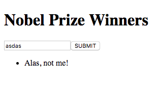

# XMLHttpRequest Example Application

## Overview

This repo provides a starter web application with supporting backend application for demonstrating how to use the [XMLHttpRequest](https://developer.mozilla.org/en-US/docs/Web/API/XMLHttpRequest) browser object for accessing a Web API.

The Web API exposed here provides information about Nobel Prize Winners and Nobel Laureates, i.e. persons or organizations that have been awarded a Nobel Prize.

Although there is an online [NobelPrize.org](https://nobelprize.readme.io/) API, it was chosen for this repo to provide the Laureate and Prize information through a local backend, so that the application can be demonstrated and extended without the need for an Internet connection. However, the actual Nobel Prize data used here was downloaded in JSON data format through the official API.

## Installation

To install this application, follow these steps:

1. (Optionally) fork this repo to your own GitHub account.

2. Clone the (forked) repo to your local machine.

3. Open the repo folder in VSCode.

4. Open the Integrated Terminal and type:

    ```
    npm install
    ```

## Operation

1. Start the backend with the following command:

    ```
    npm start
    ```

2. Open your browser and type the following in the address bar:

    ```
    http://localhost:3000
    ```

This will open the web application. The application as cloned is unfinished. It just displays this screen:



## Folder Structure

### public

This folder contains the frontend application, initially consisting of these files:

- index.html
- app.js
- style.css

This is where you should make modifications, such as adding an `XMLHttpRequest` and handling the returned data.

### server

This folder contains the supporting backend application. For this exercise you should **not** need to modify anything in here. The backend makes use of the [json-server](https://github.com/typicode/json-server) node package.

### assets

This folder just contains the picture used in this README file.

## API

### Nobel Prizes

The backend application exposes the following Web API end point for Nobel Prizes:

```
GET http://localhost:3000/prizes
```

This particular end point returns information about **all** Nobel Prizes. 

You can query the endpoint for more specific data by adding a _query string_ to the url. For instance:

```
GET http://localhost:3000/prizes?category=economics
```


The information returned has the following JSON format (only the first two matching prize winners are shown).

```json
[
  {
    "year": "2017",
    "category": "economics",
    "laureates": [
      {
        "id": "949",
        "firstname": "Richard H.",
        "surname": "Thaler",
        "motivation": "\"for his contributions to behavioural economics\"",
        "share": "1"
      }
    ]
  },
  {
    "year": "2016",
    "category": "economics",
    "laureates": [
      {
        "id": "935",
        "firstname": "Oliver",
        "surname": "Hart",
        "motivation": "\"for their contributions to contract theory\"",
        "share": "2"
      },
      {
        "id": "936",
        "firstname": "Bengt",
        "surname": "Holmström",
        "motivation": "\"for their contributions to contract theory\"",
        "share": "2"
      }
    ]
  }
]
```

### Nobel Laureates

The backend application exposes the following Web API end point for Nobel Laureates:

```
GET http://localhost:3000/laureates
```

As specified, this particular end point returns information about **all** Nobel Laureates. 

You can query the endpoint for more specific data by adding a _query string_ to the url. For instance:

```
GET http://localhost:3000/laureates?surname=Dylan
```

The information returned has the following JSON format:

```json
[
  {
    "id": "937",
    "firstname": "Bob",
    "surname": "Dylan",
    "born": "1941-05-24",
    "died": "0000-00-00",
    "bornCountry": "USA",
    "bornCountryCode": "US",
    "bornCity": "Duluth, MN",
    "gender": "male",
    "prizes": [
      {
        "year": "2016",
        "category": "literature",
        "share": "1",
        "motivation": "\"for having created new poetic expressions within the great American song tradition\"",
        "affiliations": [
          []
        ]
      }
    ]
  }
]
```

## More information

For information on how to construct other query strings, e.g. to filter information using specific criteria check the documentation of json-server [here](https://github.com/typicode/json-server#filter).

